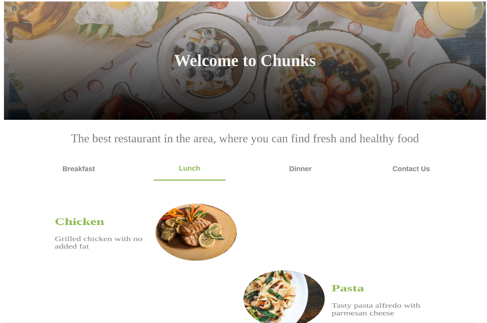

# Chunks Restaurant Page

> The idea of this project is to create the entire page content using JavaScript and modules.

All the functionality and assets presented in the page are generated using JavaScript modules and DOM manipulation. All the files are bundled together using webpack with loaders for image compression and css incorporation.

## Built With

- Javascript,
- DOM,
- Webpack

## Live Demo

[Live Demo Link](https://raw.githack.com/mateomh/restaurant-webpack/restaurant-page/dist/index.html)

### Usage

Everything you need to run the page is inside the **dist** folder of the project.

## Authors

👤 **Mateo mojica**

- Github: [@mateomh](https://github.com/mateomh)
- Twitter: [@mateo_m_h](https://twitter.com/mateo_m_h)
- Linkedin: [Mateo mojica](https://linkedin.com/mateo_mojica_hernandez)

## 🤝 Contributing

Contributions, issues and feature requests are welcome!

Feel free to check the [issues page](issues/).

## Show your support

Give a ⭐️ if you like this project!

## Acknowledgments

- Odin Project
- Microverse

## 📝 License

This project is [MIT](https://opensource.org/licenses/MIT) licensed.

## Image credits

All the images used in the page were taken from [Unsplash](https://unsplash.com/s/photos/food?utm_source=unsplash&amp;utm_medium=referral&amp;utm_content=creditCopyText) and in this section are the people that made them and deserve recognition.

<a href="https://unsplash.com/@danielcgold?utm_source=unsplash&amp;utm_medium=referral&amp;utm_content=creditCopyText">Dan Gold</a>

<a href="https://unsplash.com/@brookelark?utm_source=unsplash&amp;utm_medium=referral&amp;utm_content=creditCopyText">Brooke Lark</a>

<a href="https://unsplash.com/@therachelstory?utm_source=unsplash&amp;utm_medium=referral&amp;utm_content=creditCopyText">Rachel Park</a>

<a href="https://unsplash.com/@tempestdesigner?utm_source=unsplash&amp;utm_medium=referral&amp;utm_content=creditCopyText">Mark DeYoung</a>

<a href="https://unsplash.com/@keriliwi?utm_source=unsplash&amp;utm_medium=referral&amp;utm_content=creditCopyText">Keri liwi</a>

<a href="https://unsplash.com/@eaterscollective?utm_source=unsplash&amp;utm_medium=referral&amp;utm_content=creditCopyText">Eaters Collective</a>

<a href="https://unsplash.com/@nikldn?utm_source=unsplash&amp;utm_medium=referral&amp;utm_content=creditCopyText">nikldn</a>

<a href="https://unsplash.com/@alyssa1212?utm_source=unsplash&amp;utm_medium=referral&amp;utm_content=creditCopyText">Alyssa li</a>

<a href="https://unsplash.com/@brookelark?utm_source=unsplash&amp;utm_medium=referral&amp;utm_content=creditCopyText">Brooke Lark</a>

<a href="https://unsplash.com/@lavievagabonde?utm_source=unsplash&amp;utm_medium=referral&amp;utm_content=creditCopyText">Jasmin Schreiber</a>

<a href="https://unsplash.com/@carolineattwood?utm_source=unsplash&amp;utm_medium=referral&amp;utm_content=creditCopyText">Caroline Attwood</a>

<a href="https://unsplash.com/@milesb?utm_source=unsplash&amp;utm_medium=referral&amp;utm_content=creditCopyText">Miles Burke</a>